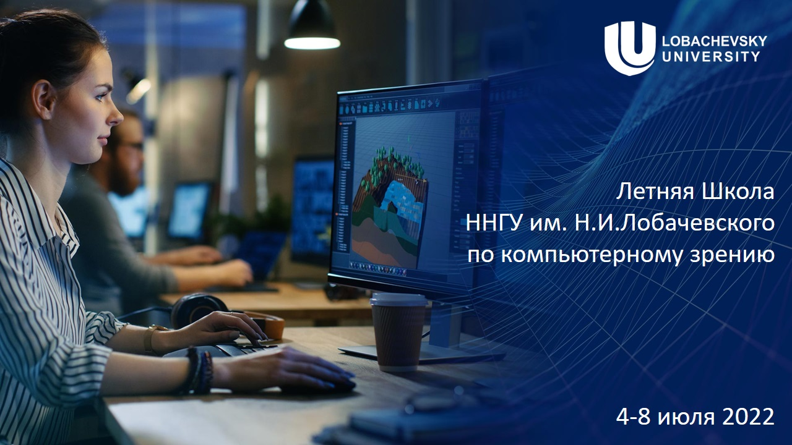
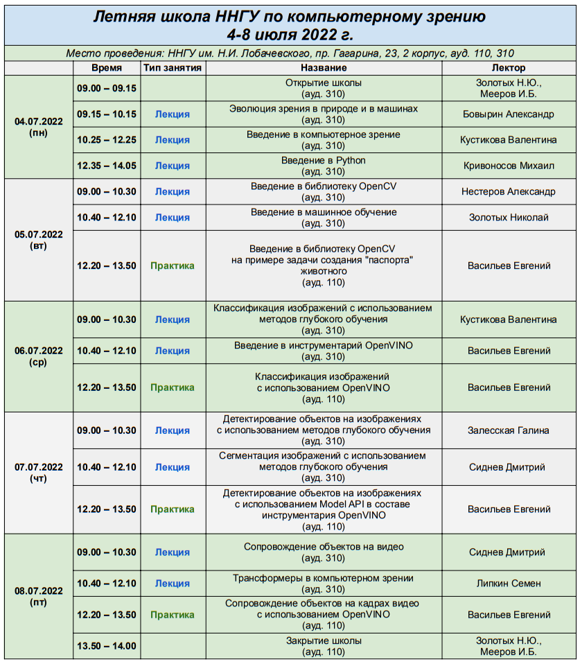

# CV-SUMMER-CAMP-2022
Репозиторий материалов Летней школы ННГУ им. Н.И. Лобачевского по компьютерному зрени

## Состав репозитория

  - В папке [lectures](lectures/) хранятся материалы лекций
  - В папке [practice](practice/) хранятся материалы практик

## Расписание школы

## Дополнительные материалы

Курс "Современные методы и технологии глубокого обучения в компьютерном зрении"
[Ссылка](http://hpc-education.unn.ru/ru/%D0%BE%D0%B1%D1%83%D1%87%D0%B5%D0%BD%D0%B8%D0%B5/%D0%BA%D1%83%D1%80%D1%81%D1%8B/%D0%BC%D0%B0%D0%B3%D0%B8%D1%81%D1%82%D1%80%D0%B0%D1%82%D1%83%D1%80%D0%B0/deep_learning_in_computer_vision_2)
